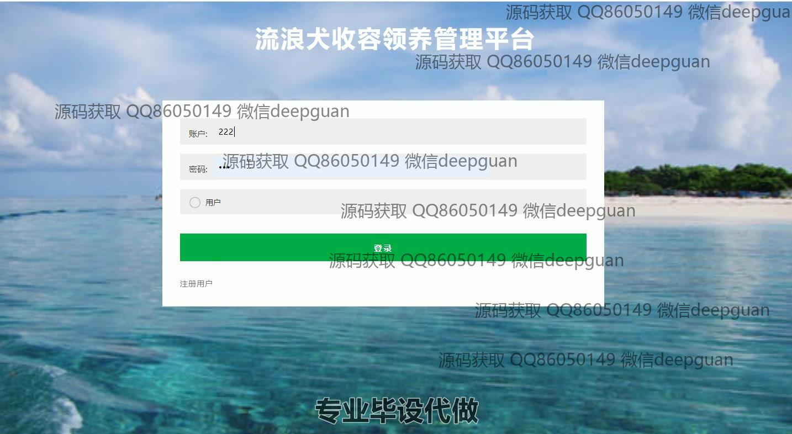

<h1 align="center">基于Web的流浪狗收容领养管理平台</h1>

## 简介
流浪狗收容领养管理平台提供管理员信息、用户管理、收容管理、在库犬管理、领养回访管理等功能，支持流浪狗信息录入、编辑、筛选、审核和用户领养管理，提高运营效率和用户体验。    --计算机毕业设计源码；毕设源码；java毕业设计源码

## 联系方式

<h3 align="center">获取完整代码与数据库文件 + 微信：deepguan QQ: 86050149 QQ群: 783742310</h3>

<h3 align="center">可帮忙远程部署 包运行成功！提供远程部署、修改代码、设计文档指导、代码讲解等服务！</h3>

## 功能介绍（完整见运行截图）
管理员： 基本功能包括登录、注册、密码修改和退出。可以通过主导航栏访问用户管理、在库犬管理、收容管理、领养回访管理等模块，查看并编辑犬只信息如编号、性别、品种、性格、接收时间等；管理用户基本信息如账号、姓名、身份证号、联系方式，并支持添加、修改、删除和批量操作；统计犬只的收容、领养状态，辅助决策；支持养犬资讯发布和轮播图管理。

用户： 基本功能包括登录、注册、密码修改和退出。个人中心模块提供基本信息查看与更新，如账号、姓名、联系方式；支持上传头像和查看个人领养记录；可通过平台查看待领养犬只的详细信息，如编号、品种、性别、性格、疫苗接种状态等；提交领养申请并跟进回访记录；提供租房状态及房东意见等必要信息用于领养资格审核。

领养者： 可浏览平台首页，查看待领养犬只的展示信息，包括犬种、编号、性格、接收时间等；通过申请页面提交领养请求，填写相关细节如租房状况及房东同意与否；在“我的收养犬”模块查看申请进度及收养记录，更新个人信息；支持在线回访记录填写，方便后续管理。

游客： 可浏览平台公开内容，如待领养犬只的基本信息展示和平台养犬资讯模块；在注册后可解锁更多功能如提交领养申请、查看个人中心、上传头像和修改信息；通过首页导航进入不同模块了解平台功能和公益理念，提升领养意识。

## 运行截图

本代码来源于网络,仅供学习参考使用!

